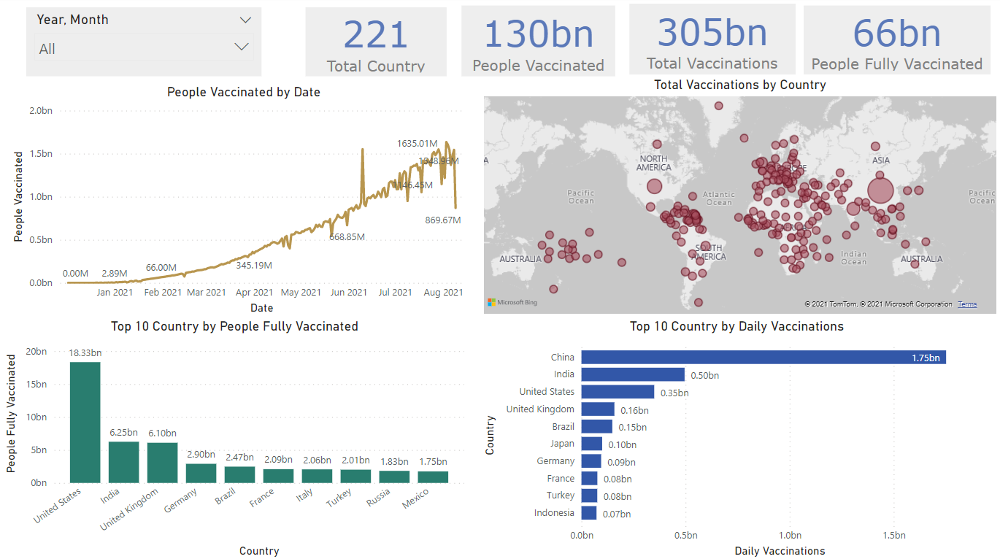

# COVID ANALYSIS USING POWER BI

It has been over two years since we started this difficult battle against Covid-19 and it has cost us dearly. These fast-spreading microscopic creatures that are too small to be even be seen with the naked eye have somehow shaken the entire world and changed life as we know it
People all over the world are racing against the clock to fight this pandemic. The main objective is to explore COVID vaccine data and try to find out the inference of how the immunization process is going on worldwide.
The selected dataset has detailed information of the Covid - 19 Vaccination details, thus the primary objective of this report is to analyse the vaccination count & progress of vaccination in different parts of the world using power BI tool

The business problems that are be solved are

1.	Total Number of people Vaccinated sorting by Date
2.	Top 10 Country by People Fully Vaccinated
3.	Total Vaccinations by Country
4.	Where are vaccinated more people per day? 
5.	Which country is using what vaccine?
6.	In which country the vaccination programme is more advanced?
7.	Top 10 Country by Daily Vaccinations
8.	Comparison of countries based on Partial vaccinations & people fully vaccinated

## Data Source: https://github.com/owid/covid-19-data
Data is collected from Our World in Data GitHub repository for covid-19. Country level vaccination data is gathered and assembled in one single file. Then, this data file is merged with locations data file to include vaccination sources information. A second file, with manufacturer’s information, is included.
The data (country vaccinations) contains the following information:
1. Country - this is the country for which the vaccination information is provided
2. Country ISO Code  - ISO code for the country
3. Date - date for the data entry; for some of the dates we have only the daily vaccinations, for others, only the (cumulative) total
4.	Total number of vaccinations - this is the absolute number of total immunizations in the country
5.	Total number of people vaccinated - a person, depending on the immunization scheme, will receive one or more (typically 2) vaccines; at a certain moment, the number of vaccination might be larger than the number of people
6.	Total number of people fully vaccinated - this is the number of people that received the entire set of immunization according to the immunization scheme (typically 2); at a certain moment in time, there might be a certain number of people that received one vaccine and another number (smaller) of people that received all vaccines in the scheme
7.	Daily vaccinations (raw) - for a certain data entry, the number of vaccination for that date/country
8.	Daily vaccinations - for a certain data entry, the number of vaccination for that date/country
9.	Total vaccinations per hundred - ratio (in percent) between vaccination number and total population up to the date in the country
10.	Total number of people vaccinated per hundred - ratio (in percent) between population immunized and total population up to the date in the country
11.	Total number of people fully vaccinated per hundred - ratio (in percent) between population fully immunized and total population up to the date in the country
12.	Number of vaccinations per day - number of daily vaccination for that day and country
13.	Daily vaccinations per million - ratio (in ppm) between vaccination number and total population for the current date in the country
14.	Vaccines used in the country - total number of vaccines used in the country (up to date)
15.	Source name - source of the information (national authority, international organization, local organization etc.)
16.	Source website - website of the source of information

## Dashboard

## Conclusion
COVID-19, a new and sometimes deadly respiratory illness has spread rapidly throughout that country and the world. The new coronavirus was first detected in Wuhan, China in December 2019. Tens of thousands of people were infected in China, with the virus spreading easily from person-to-person in many parts of that country. The novel coronavirus has now established itself in 177 countries and territories around the world in a rapidly expanding pandemic. Health officials in the United States and around the world are working to contain the spread of the virus through public health measures such as social distancing, contact tracing, testing, quarantines and travel restrictions. So these kind of statistics would be helpful to prevent corona virus as it gives us the whole picture of how many people gets vaccinated in each country and how people feel about the reliability of vaccines.

